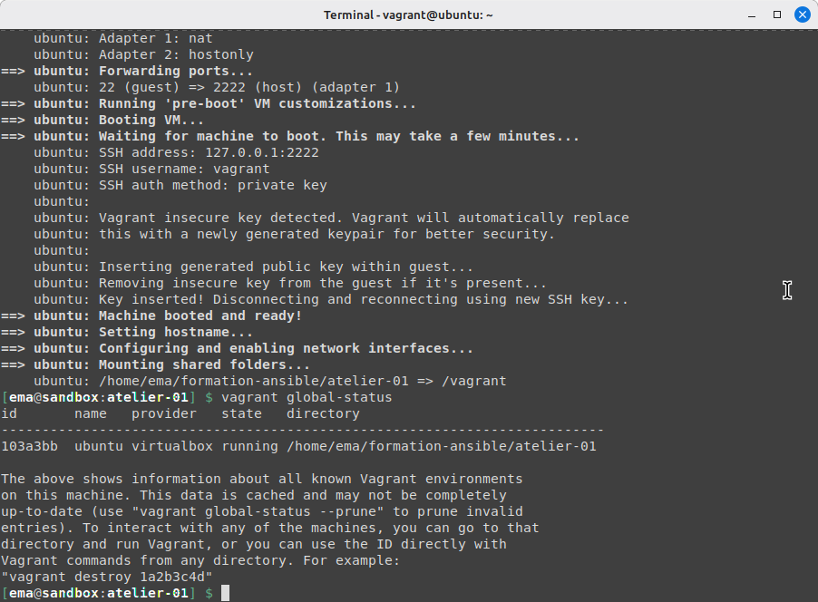
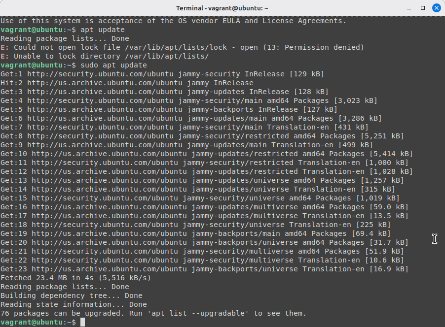
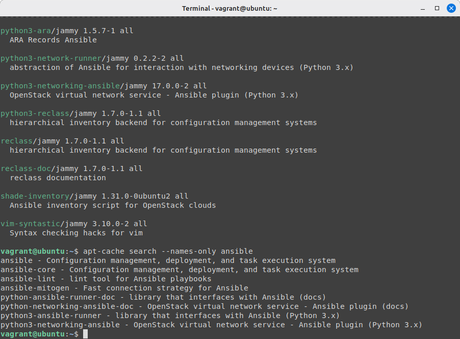
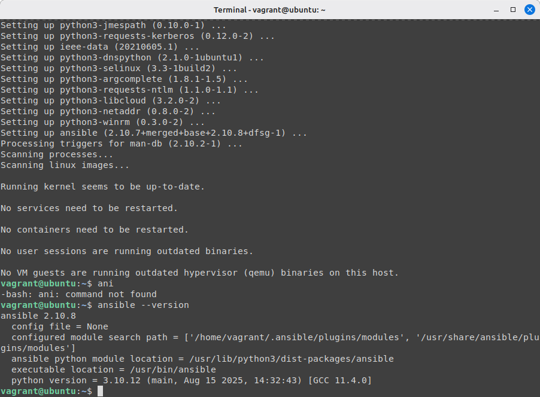
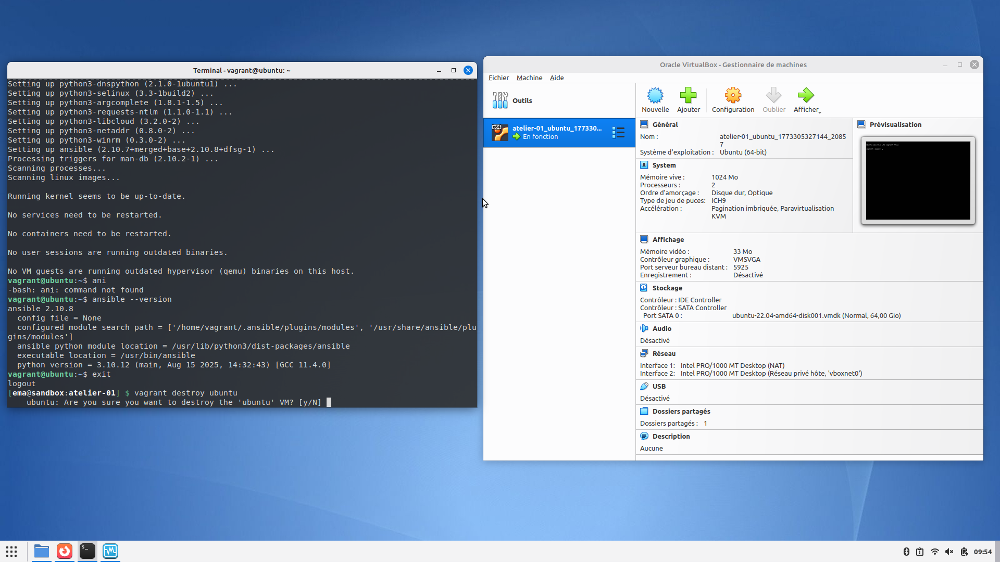
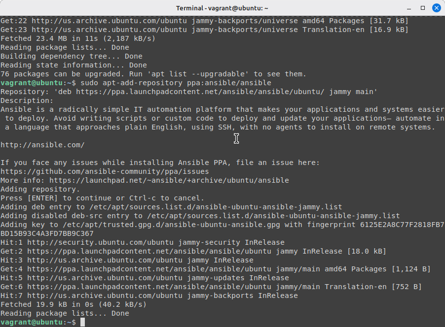
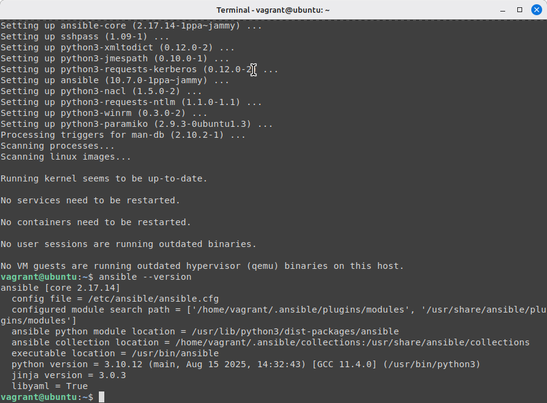
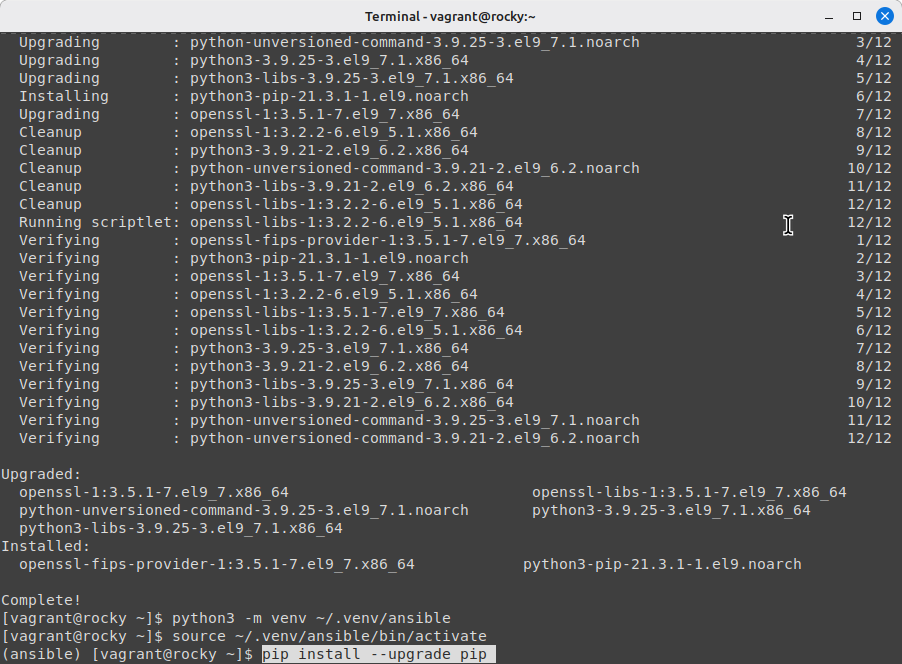
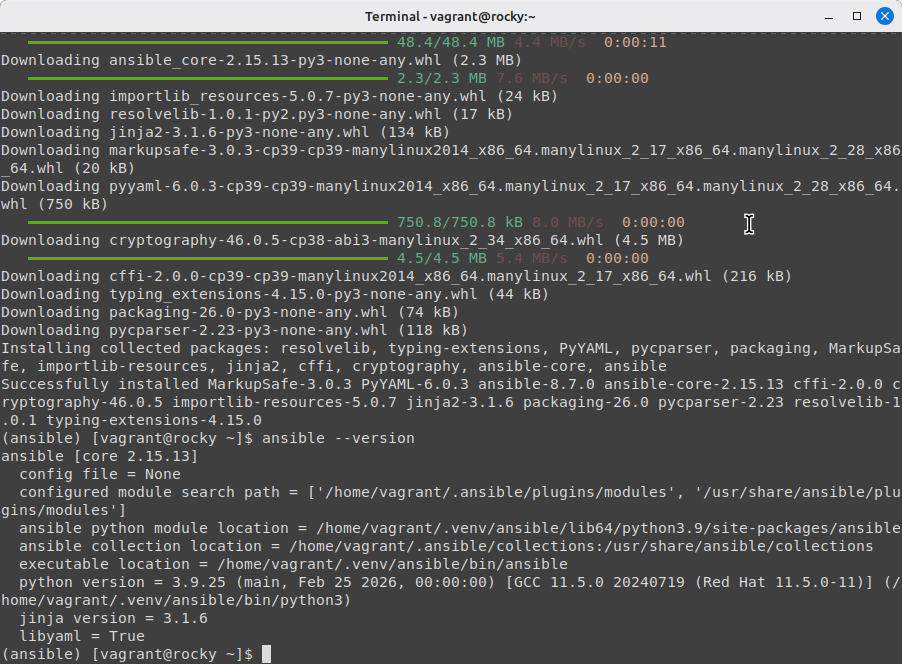

# Atelier 01 – Installation d'Ansible

## Challenge 1

### Démarrage de la VM Ubuntu

Démarrez la VM Ubuntu depuis le répertoire `atelier-01`.

```bash
cd ~/formation-ansible/atelier-01
vagrant up ubuntu
vagrant global-status
```
 
### Connexion à la VM

```bash
vagrant ssh ubuntu
```
### Rafraîchir les informations sur les paquets

```bash
sudo apt update
```
 
### Rechercher le paquet Ansible

Recherche simple :
```bash
apt search ansible
```
Recherche plus précise pour récupérer les bons paquets :
```bash
apt-cache search --names-only ansible
```
 
### Installer le paquet officiel fourni par la distribution

```bash
sudo apt install ansible
```
### Vérifier l'installation

```bash
ansible --version
```
 

### Nettoyage

Déconnectez-vous et supprimez la VM.
```bash
exit
vagrant destroy -f ubuntu
```
 
## Challenge 2

Répétez le challenge précédent en configurant un dépôt PPA (Personal Package Archive) pour Ansible.

Avant de lancer l'installation, configurez le dépôt :
```bash
sudo apt-add-repository ppa:ansible/ansible
```
 
Installez ensuite Ansible :
```bash
sudo apt install ansible
```
Vérifiez la version :
```bash
ansible --version
```
 
Nettoyage :
```bash
exit
vagrant destroy -f ubuntu
```

## Challenge 3

### Création de la VM Rocky Linux

Depuis le répertoire `atelier-01` :
```bash
cd ~/formation-ansible/atelier-01
vagrant up rocky
vagrant global-status
```
### Vérifier les dépôts
Lister les dépôts activés :
```bash
dnf repolist
```
Installer et activer le dépôt EPEL pour Ansible :
```bash
sudo dnf install -y epel-release
sudo crb enable
```

### Rechercher les paquets Python nécessaires
```bash
dnf search python3
```

### Installation de l'environnement Python et d'Ansible
Installer Python et pip :
```bash
sudo dnf install python3 python3-pip
```
Créer un environnement virtuel :
```bash
python3 -m venv ~/.venv/ansible
```
Activer l'environnement virtuel :
```bash
source ~/.venv/ansible/bin/activate
```
Mettre à jour pip :
```bash
pip install --upgrade pip
```
 
Installer Ansible :
```bash
pip install ansible
```

### Vérifier l'installation
```bash
ansible --version
```
 
### Nettoyage

Quitter l'environnement virtuel et supprimer la VM :
```bash
deactivate
exit
vagrant destroy -f rocky