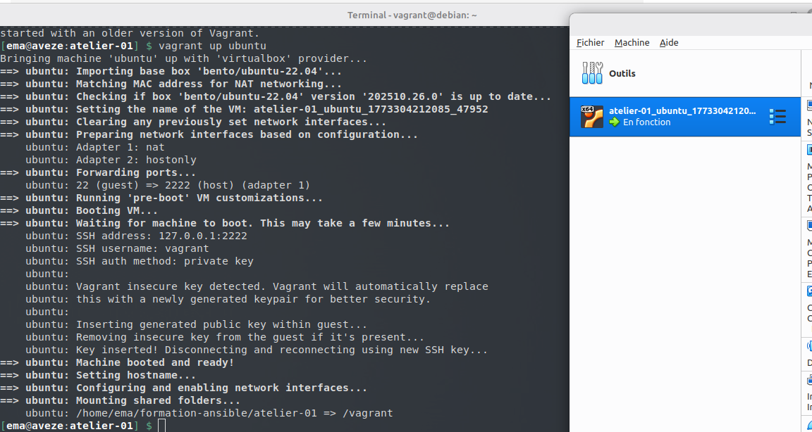
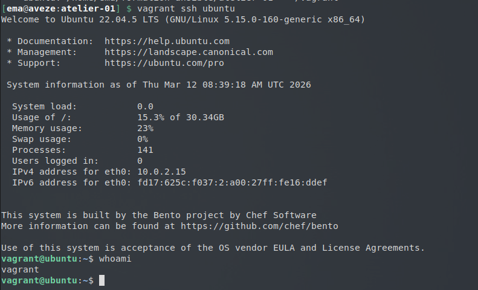
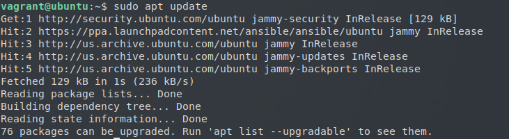

# Atelier 01
## Challenge 1
### Démmarage de la VM

Démarrez la VM ubuntu depuis le répertoire atelier-01.
```bash
$ cd atelier-01
$ vagrant up ubuntu
```

-------------------

### Connexion

On se connecte ensuite à la machine en ssh.
```bash
$ vagrant ssh ubuntu
```

-------------------

### Installation d'Ansible

On raffraichit les paquets :
```bash
$ sudo apt update
```

On recherche dans les repositories le paquet ansible :
```bash
$ apt-cache search --names-only ansible
```

On peut ensuite installer le paquet :
```bash
$ sudo apt install ansible -y
```

Pour savoir si l'installation s'est passé sans accros, on check la version d'Ansible :
```bash
$ ansible --version
```
ansible 2.10.8

### Destruction de la machine
Une fois nos tâches finies, nous pouvons détruire la machine.

```bash
$ vagrant destroy -f ubuntu
```

## Challenge 2
### Démarrage et connexion à la VM

On rallume la VM 
```bash
$ vagrant up ubuntu
$ vagrant ssh ubuntu
```

### Ajout du dépôt ppa
```bash
$ sudo apt-add-repository ppa:ansible/ansible
```

Une fois ajouté, on lance la mise à jour :
```bash
$ sudo apt update
```


--------------------

```bash
$ sudo apt install ansible -y
$ ansible --version
```
ansible [core 2.17.14]

## Destruction de la machine
Une fois nos tâches finies, nous pouvons détruire la machine.

```bash
$ vagrant destroy -f ubuntu
```

## Challenge 3 
### Démarrage de Rocky
Démarrez la VM ubuntu depuis le répertoire atelier-01.
```bash
$ cd atelier-01
$ vagrant up rocky
```

On se connecte sur cette machine rocky :
```bash
$ vagrant ssh rocky
```

### Installation Python et venv
Nous allons installer ansible d'une manière différente cette fois ci, sans passer par le gestionnaire de paquet classique.

Dans un premier temps, on raffraichit les paquets sur Rocky, puis on install pip et python-devel :
```bash
$ dnf check-update
$ sudo dnf install python3-pip python-devel -y
```

On initialise le Venv, puis on le lance : 
```bash
$ python3 -m venv ~/.venv/ansible
$ source ~/.venv/ansible/bin/activate
```

On lance ensuite une mise à jour de PIP, puis on installe ansible via PIP :
```bash
$ pip install --upgrade pip
$ pip install ansible
```

Pour vérifier, on regarde la version d'ansible installer :
```bash
$ ansible --version
```
ansible [core 2.15.13]

## Destruction de la machine
Une fois nos tâches finies, nous pouvons détruire la machine.

```bash
$ vagrant destroy -f rocky
```