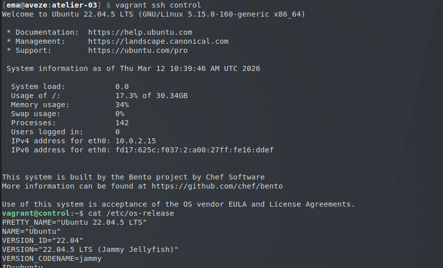
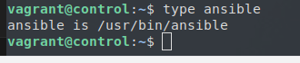
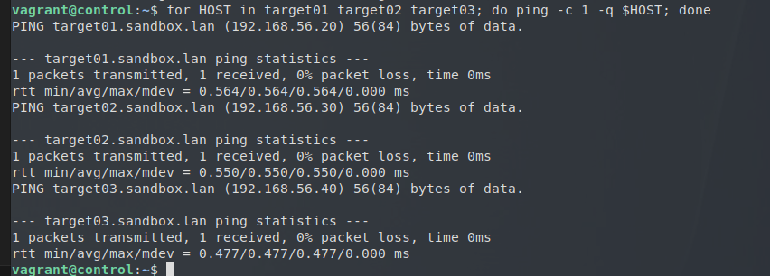
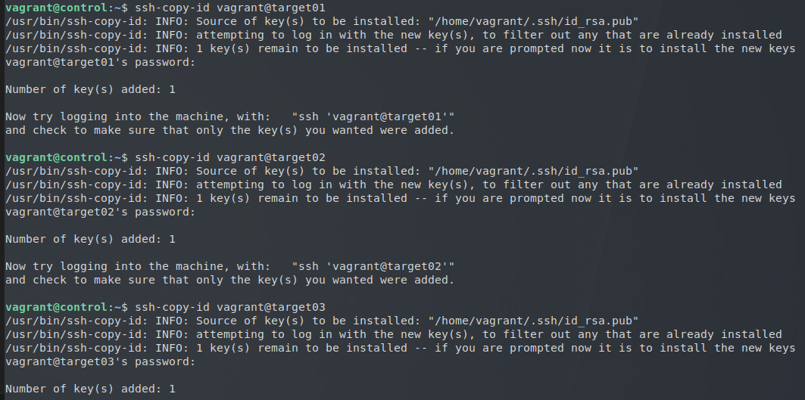
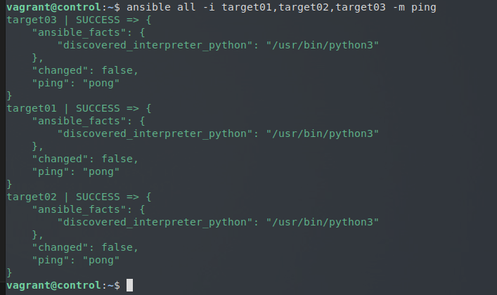

# Atelier 03
## Atelier pratique
### Initialisation des VMs

On se place dans le répertoire de l'atelier, lancer les VMs via Vagrant, puis s'y connecter : 

```bash
$ cd ~/formation-ansible/atelier-03
$ vagrant up
$ vagrant ssh control 
```


----------------

### Vérification sur la machine

On vérifie que Ansible est bien installé :
```bash
$ type ansible
```


-----------------

### Configuration 

Afin de permettre à notre machine control de se connecter, on modifie le /etc/hosts :

```bash
192.168.56.10  control.sandbox.lan    control
192.168.56.20  target01.sandbox.lan      target01
192.168.56.30  target02.sandbox.lan     target02
192.168.56.40  target03.sandbox.lan       target03
```

Pour tester, on utilise cette boucle :
```bash
$ for HOST in target01 target02 target03; do ping -c 1 -q $HOST; done
```

---------------

Nous pouvons désormais configurer les accès SSH. On gènère tout d'abord les clefs, puis on les envoie vers les cibles :

```bash
$ ssh-keygen
$ ssh-copy-id vagrant@target0X
```
Il faut rentrer les mots de passe de l'utilisateur vagrant pour chaque envoie de clef vers une machine target.


------------------

### Module ping Ansible

Après cela, on peut lancer le module ping d'Ansible :
```bash
$ ansible all -i target01,target02,target03 -m ping
```


-------------------