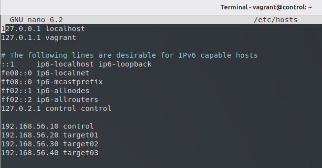
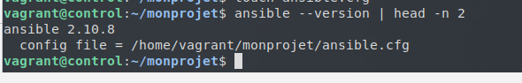
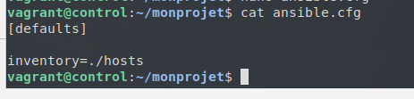
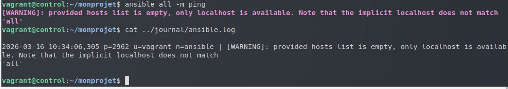
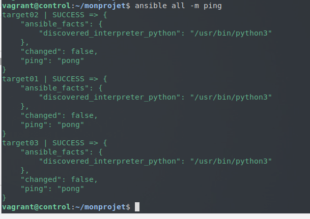
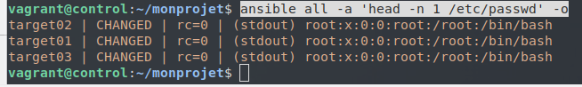

# Atelier 06
## Atelier pratique
### Initialisation des VMs

On se place dans le répertoire de l'atelier, on lance les VMs via Vagrant, puis on se connecte à la machine 'control' : 

```bash
$ cd ~/formation-ansible/atelier-06
$ vagrant up
$ vagrant ssh control
```

### Challenge

Éditez /etc/hosts de manière à ce que les Target Hosts soient joignables par leur nom d'hôte simple. 

Pour rappel :

| Machine virtuelle | Adresse IP |
|-------------------| -----------|
| control 	        |192.168.56.10 |
|target01 	        |192.168.56.20 |
|target02 	        |192.168.56.30 |
|target03 	        |192.168.56.40 |

Donc dans notre /etc/hosts :


---------------------------------

Configurez l'authentification par clé SSH avec les trois Target Hosts.

Sur la machine control :
```bash
$ ssh-keygen
$ ssh-copy-id vagrant@target0x
```

Installez Ansible.
```bash
$ sudo apt install ansible
```

Envoyez un premier ping Ansible sans configuration.
```bash
$ ansible all -i target01,target02,target03 -m ping
```

Créez un répertoire de projet ~/monprojet et créez un fichier vide ansible.cfg.
```bash
$ mkdir -v ~/monprojet && cd ~/monprojet
$ touch ansible.cfg
```


Vérifiez si ce fichier est bien pris en compte par Ansible.
```bash
$ ansible --version | head -n 2
```


--------------------

Spécifiez un inventaire nommé hosts.


--------------------


Spécifiez un inventaire nommé hosts et activez la journalisation.

```bash
[defaults]

inventory=./hosts
log_path=~/journal/ansible.log
```

Testez la journalisation.


-----------------


Créez un groupe [testlab] avec vos trois Target Hosts. Comme le /etc/hosts est déjà renseigné, on peut juste mettre le nom de la machine.

```bash
[testlab]
target01
target02
target03
```

Définissez explicitement l'utilisateur vagrant pour la connexion à vos cibles.

```bash
[testlab]
target01
target02
target03

[testlab:vars]
ansible_user=vagrant
```

Envoyez un ping Ansible vers le groupe de machines [all].
```bash
$ ansible all -m ping
```


------------------------

Définissez l'élévation des droits pour l'utilisateur vagrant sur les Target Hosts.

```bash
[testlab]
target01
target02
target03

[testlab:vars]
ansible_user=vagrant
ansible_become=true
```

Affichez la première ligne du fichier /etc/shadow sur tous les Target Hosts.

```bash
$ ansible all -a 'head -n 1 /etc/passwd' -o
```


------------------