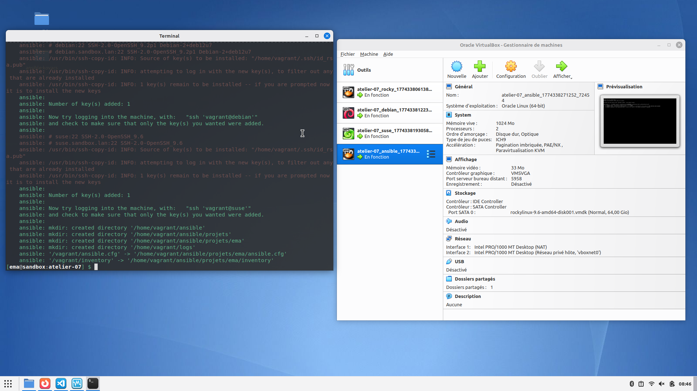
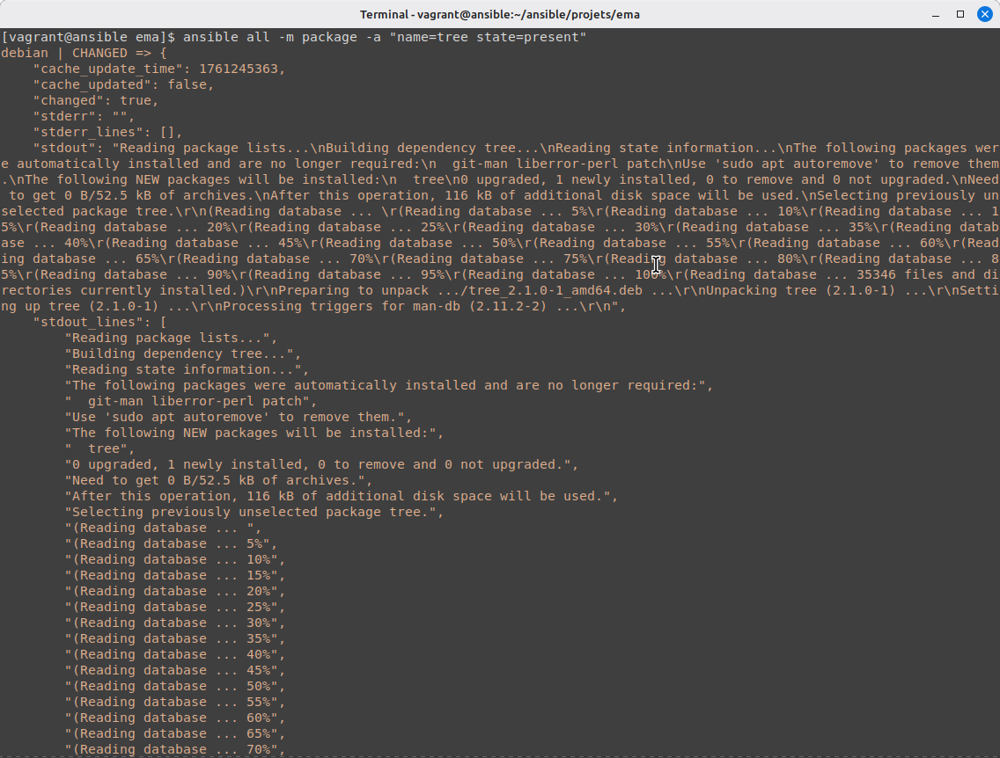
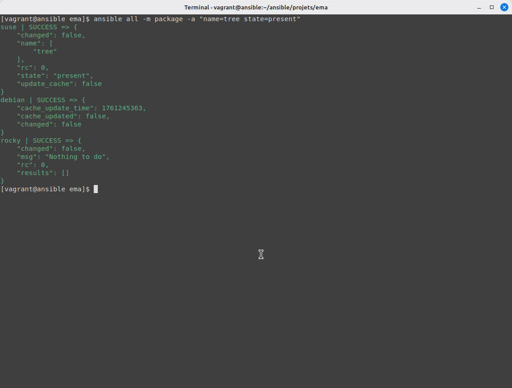
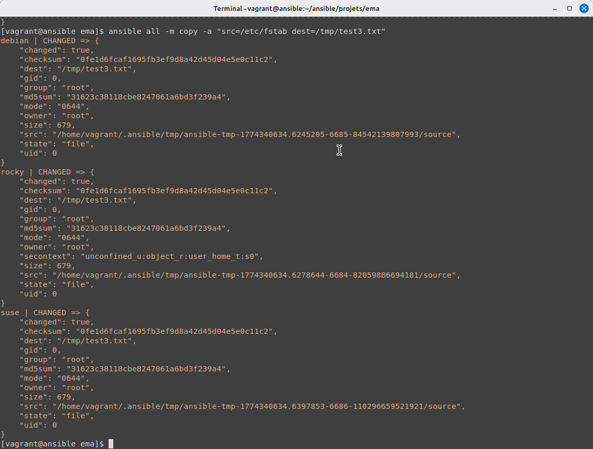
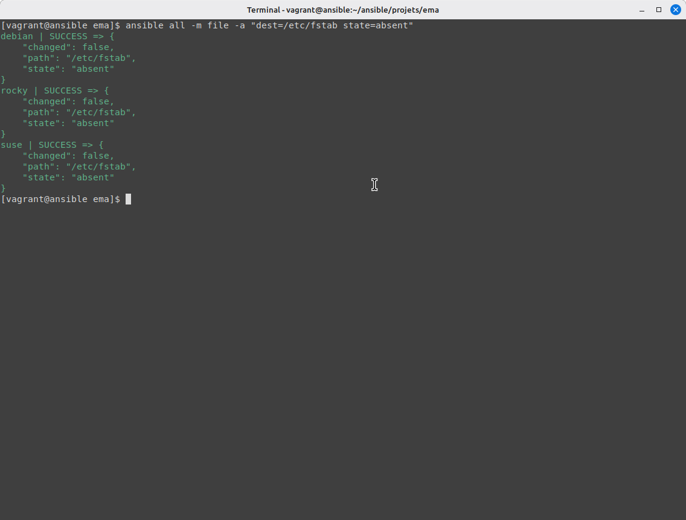
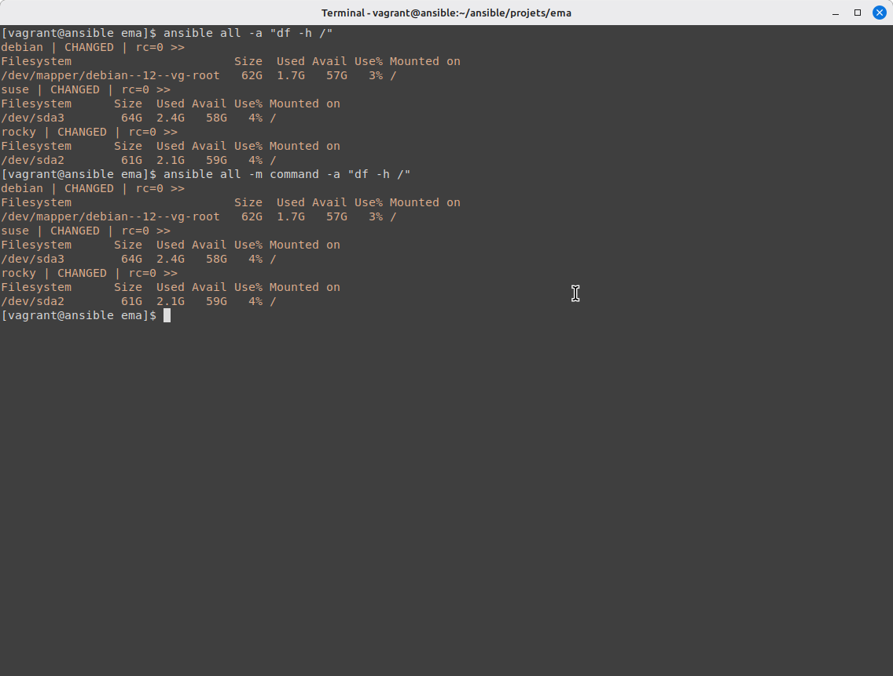

# Atelier 07 – L'Idempotence

## Challenge 

### Démarrage des VM 

Démarrez les VM depuis le répertoire `atelier-07`.

```bash
vagrant up
```
 

### Connexion au Control Host

Se rendre sur le Control Host sur lequel effetuer les opérations dans le dossier ou ansible a été initialiser (`ansible init`).

```bash
vagrant ssh ansible
cd ansible/projets/ema
```

### Installation des paquets

Installez successivement les paquets `tree`, `git` et `nmap` sur toutes les cibles.

```bash
ansible all -m package -a "name=tree state=present"
ansible all -m package -a "name=git state=present"
ansible all -m package -a "name=nmap state=present"
```
Ici l'option `state=present` est facultative mais on l'a rajouté pour bien comprendre la commande réalisée.

Exemple pour le paquet `tree`:
 
 

### Désinstallation des paquets

Désinstallez successivement ces trois paquets en utilisant le paramètre supplémentaire state=absent.

```bash
ansible all -m package -a "name=tree state=absent"
ansible all -m package -a "name=git state=absent"
ansible all -m package -a "name=nmap state=absent"
```

### Copie du fichier fstab

Copiez le fichier `/etc/fstab` du Control Host vers tous les Target Hosts sous forme d'un fichier `/tmp/test3.txt`.

```bash
ansible all -m copy -a "src=/etc/fstab dest=/tmp/test3.txt"
```
 

### Suppresion du fichier fstab

Supprimez le fichier `/tmp/test3.txt` sur les Target Hosts en utilisant le module file avec le paramètre `state=absent`.

```bash
ansible all -m file -a "dest=/etc/fstab state=absent"
```
 

### Affichage de l'espace utilisé sur les partitions principales

Enfin, affichez l'espace utilisé par la partition principale sur tous les Target Hosts. Que remarquez-vous ?

```bash
ansible all -m command -a "df -h /"
```
Ou utilisez :
```bash
ansible all -a "df -h /"
```

 

On remarque...


