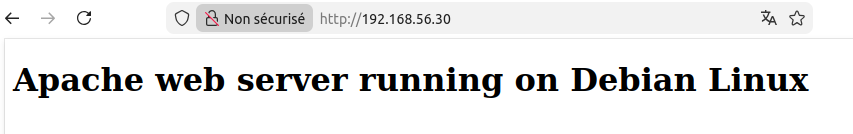
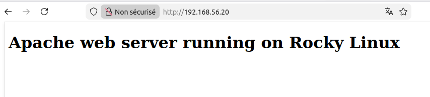
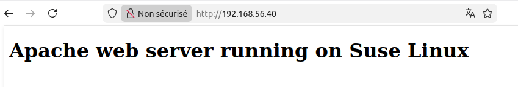

# Atelier 10
## Atelier pratique
### Initialisation des VMs

On se place dans le répertoire de l'atelier, on lance les VMs via Vagrant, puis on se connecte à la machine 'control' : 


```console
$ cd ~/formation-ansible/atelier-10
$ vagrant up
$ vagrant ssh ansible
```

## Challenge

Nous allons écrire trois playbooks.

- Playbook 1 :
    - Un premier playbook apache-debian.yml qui installe Apache sur l'hôte debian avec une page personnalisée Apache web server running on Debian Linux.

- Playbook 2 :
    - Un deuxième playbook apache-rocky.yml qui installe Apache sur l'hôte rocky avec une page personnalisée Apache web server running on Rocky Linux.

- Playbook 3 :
    - Un troisième playbook apache-suse.yml qui installe Apache sur l'hôte suse avec une page personnalisée Apache web server running on SUSE Linux.

Pour rappel :

| Machine virtuelle | Adresse IP |
|-------------------| -----------|
| ansible           |192.168.56.10 |
| rocky   	        |192.168.56.20 |
| debian  	        |192.168.56.30 |
| suse    	        |192.168.56.40 |

### Playbook 1

```yaml
---

- hosts: debian

  tasks:
    - name: Update package information
      apt:
        update_cache: true

    - name: Install apache
      apt:
	name: apache2

    - name: Set custom web page
      copy:
        dest: /var/www/html/index.html
        mode: 0644
        content: |
          <!doctype html>
          <html>
            <head>
              <meta charset="utf-8">
              <title>Test</title>
            </head>
            <body>
              <h1>Apache web server running on Debian Linux</h1>
            </body>
          </html>
...
```

On éxécute ensuite le playbook :
```console
$ ansible-playbook playbooks/apache-debian.yml
```

En se rendant sur la page web :

-------------


### Playbook 2

```yaml
---  # apache-rocky.yml

- hosts: rocky

  tasks:

    - name: Update package information
      dnf:
        update_cache: true

    - name: Install Apache
      dnf:
        name: httpd

    - name: Start & enable Apache
      service:
        name: httpd
        state: started
        enabled: true

    - name: Install custom web page
      copy:
        dest: /var/www/html/index.html
        mode: 0644
        content: |
          <!doctype html>
          <html>
            <head>
              <meta charset="utf-8">
              <title>Test</title>
            </head>
            <body>
              <h1>Apache web server running on Rocky Linux</h1>
            </body>
          </html>

...
```

On éxécute ensuite le playbook :
```console
$ ansible-playbook playbooks/apache-rocky.yml
```

En se rendant sur la page web :

---------------


### Playbook 3

```yaml
---  # apache-suse.yml

- hosts: suse

  tasks:

    - name: Update package information
      community.general.zypper:
        name: '*'
        state: latest

    - name: Install Apache
      community.general.zypper:
        name: apache2
        state: present

    - name: Start & enable Apache
      service:
        name: apache2
        state: started
        enabled: true

    - name: Install custom web page
      copy:
        dest: /srv/www/htdocs/index.html
        mode: 0644
        content: |
          <!doctype html>
          <html>
            <head>
              <meta charset="utf-8">
              <title>Test</title>
            </head>
            <body>
              <h1>Apache web server running on Suse Linux</h1>
            </body>
          </html>
...
```

On éxécute ensuite le playbook :
```console
$ ansible-playbook playbooks/apache-suse.yml
```

En se rendant sur la page web :
