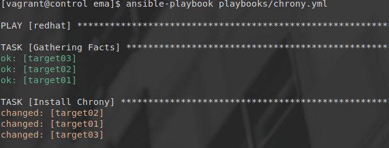
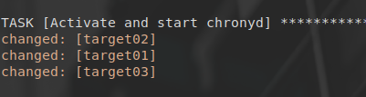
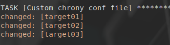
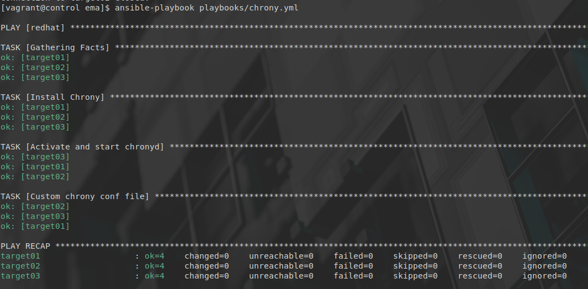

# Atelier 12
## Atelier pratique
### Initialisation des VMs

On se place dans le répertoire de l'atelier, on lance les VMs via Vagrant, puis on se connecte à la machine 'control' : 

```console
$ cd ~/formation-ansible/atelier-10
$ vagrant up
$ vagrant ssh control
```

## Challenge

Pour commencer, on installe le paquet chrony.

```yaml
---

- hosts: redhat

  tasks:
    - name: Install Chrony
      dnf:
        name: chrony
```


--------------------

Ensuite on active et on démarre le service chronyd correspondant.

```yaml
- name: Activate and start chronyd
      service:
        name: chronyd
        state: started
        enabled: true
```


------------------

On installe ensuite la version personnalisé du fichier de configuration personnalisé que voici:

```conf
# /etc/chrony.conf
server 0.fr.pool.ntp.org iburst
server 1.fr.pool.ntp.org iburst
server 2.fr.pool.ntp.org iburst
server 3.fr.pool.ntp.org iburst
driftfile /var/lib/chrony/drift
makestep 1.0 3
rtcsync
logdir /var/log/chrony
```

On ajoute ensuite la section permettant d'envoyer ce contenu dans le nouveau fichier chrony.conf. Optionnellement, on peut garder un exemplaire du fichier de base avec l'option backup. On ajoute également un notify, afin de redémarrer le service une fois l'ajout du fichier de conf envoyer.

```yaml
- name: Custom chrony conf file
    copy:
      dest: /etc/chrony.conf
      mode: 0644
      content: |
        # /etc/chrony.conf
        server 0.fr.pool.ntp.org iburst
        server 1.fr.pool.ntp.org iburst
        server 2.fr.pool.ntp.org iburst
        server 3.fr.pool.ntp.org iburst
        driftfile /var/lib/chrony/drift
        makestep 1.0 3
        rtcsync
        logdir /var/log/chrony
      backup: true
    notify: Relaod Chrony

handlers:
  - name: Reload Chrony
    service:
      name: chronyd
      state: restarted
```

Remarque: Le handler se nomme reload Chrony, malgré le fait que le service chronyd ne supporte pas la directive reload. Ce "reload" effectue un restart.


------------------

Nous pouvons maintenant vérifier la syntaxe de notre playbook :
```console
$ yamllint playbooks/chrony.yml
```

La commande ne retourne rien, donc notre playbook est parfaitement structuré et sans erreur !

Contenu complet du playbook :
```yaml
---

- hosts: redhat

  tasks:
    - name: Install Chrony
      dnf:
        name: chrony

    - name: Activate and start chronyd
      service:
        name: chronyd
        state: started
        enabled: true

    - name: Custom chrony conf file
      copy:
        dest: /etc/chrony.conf
        mode: 0644
        content: |
          # /etc/chrony.conf
          server 0.fr.pool.ntp.org iburst
          server 1.fr.pool.ntp.org iburst
          server 2.fr.pool.ntp.org iburst
          server 3.fr.pool.ntp.org iburst
          driftfile /var/lib/chrony/drift
          makestep 1.0 3
          rtcsync
          logdir /var/log/chrony
        backup: true

      notify: Reload Chrony

  handlers:
    - name: Reload Chrony
      service:
        name: chronyd
        state: restarted
```

Maintenant on le lance afin de vérifier l'idempotence. Comme nous avons lancé chaque tâche individuellement, nous devrions avoir toute les tâches en status OK.


--------------------

L'idempotence est confirmée. Ce challenge est terminé.