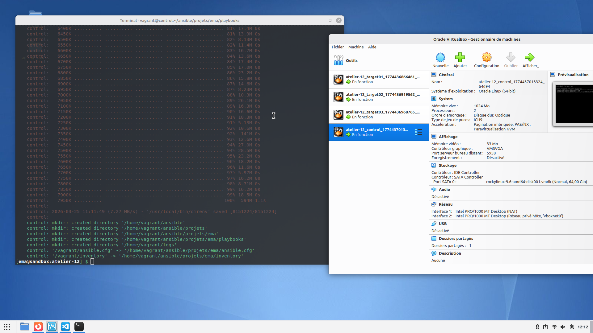
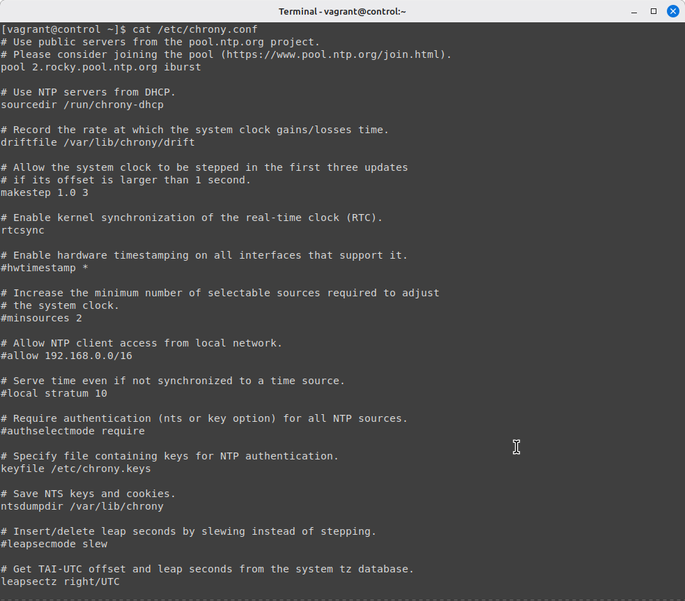
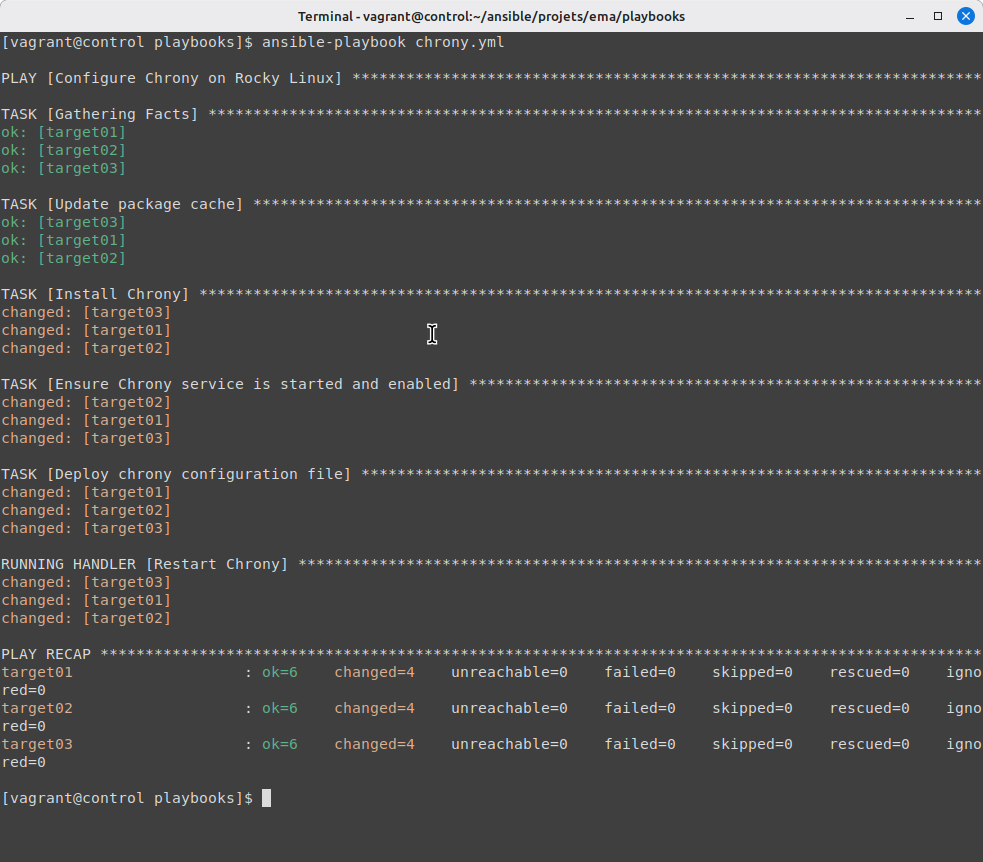
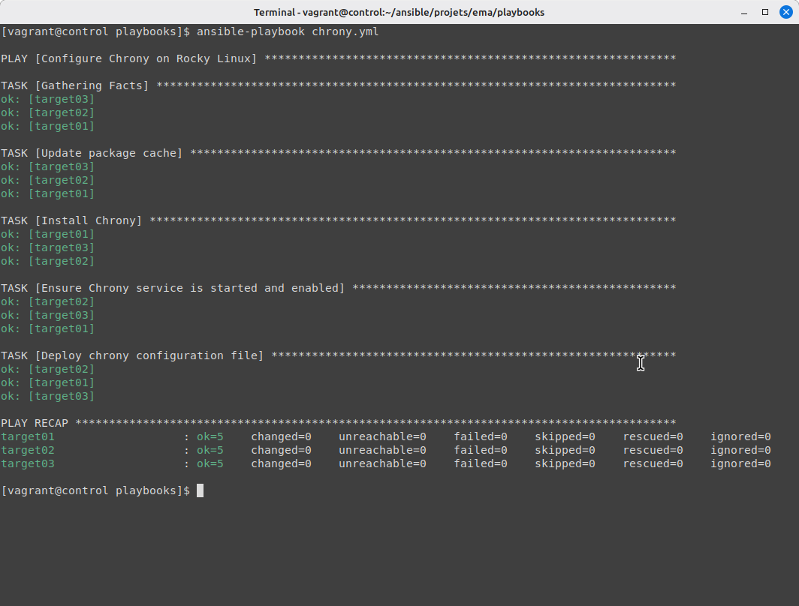

# Atelier 12 – Les handlers

## Challenge 

### Démarrage des VM 

Démarrez les VM depuis le répertoire `atelier-12`.

```bash
vagrant up
```
 

### Création du playbook chrony.yml

```bash
cd /home/vagrant/ansible/projets/ema/playbooks
touch chrony.yml
```

### Installation du paquet chrony à partir du playbook

Installez le paquet `chrony`.

```yaml
---  # chrony.yml

- hosts: redhat

  tasks:

    - name: Update package information
      dnf:
	update_cache: true

    - name: Install Chrony
      dnf:
	name: chrony
        state: present
```
Ici la première tâche permet de mettre à jour les paquets afin d'ensuite lancer l'installation

### Activation et démarrage du service chronyd

Activez et démarrez le service `chronyd` correspondant.

```yaml
    - name: Start & enable Chrony
      service:
	name: chronyd
        state: started
        enabled: true
```
### Observation et Mise en place de la configuration personnalisée du fichier /etc/chrony.conf

Jetez un œil sur le fichier de configuration `/etc/chrony.conf` fourni par défaut.

```bash
cat /etc/chrony.conf
```
 

Installez une configuration personnalisée (configuration présente dans l'atelier-12 du blog).

```yaml
    - name: Install custom file chrony.conf
      copy:
	dest: /etc/chrony.conf
        mode: 0644
        content: |
          # /etc/chrony.conf
          server 0.fr.pool.ntp.org iburst
          server 1.fr.pool.ntp.org iburst
          server 2.fr.pool.ntp.org iburst
          server 3.fr.pool.ntp.org iburst
          driftfile /var/lib/chrony/drift
          makestep 1.0 3
          rtcsync
          logdir /var/log/chrony
```

### Prise en compte de la configuration personnalisée

Prenez en compte cette nouvelle configuration.

```bash
ansible-playbook chrony.yml
```
 

### Vérification de la syntaxe de notre playbook

Vérifiez la syntaxe correcte de votre playbook chrony.yml (en se plaçant dans le répertoire `/home/vagrant/ansible/projets/ema/playbooks`).

```bash
yamllint chrony.yml
```

### Vérification d'idempotence de notre playbook chrony.yml

Vérifiez l'idempotence de votre playbook. Afin de vérifier l'idempotence de notre playbook le voici dans son intégralité.

```yaml
---
# chrony.yml

- name: Configure Chrony on Rocky Linux
  hosts: redhat
  become: true

  tasks:

    - name: Update package cache
      dnf:
        update_cache: true

    - name: Install Chrony
      dnf:
        name: chrony
        state: present

    - name: Ensure Chrony service is started and enabled
      service:
        name: chronyd
        state: started
        enabled: true

    - name: Deploy chrony configuration file
      copy:
        dest: /etc/chrony.conf
        mode: '0644'
        content: |
          # /etc/chrony.conf
          server 0.fr.pool.ntp.org iburst
          server 1.fr.pool.ntp.org iburst
          server 2.fr.pool.ntp.org iburst
          server 3.fr.pool.ntp.org iburst
          driftfile /var/lib/chrony/drift
          makestep 1.0 3
          rtcsync
          logdir /var/log/chrony
      notify: Restart Chrony

  handlers:

    - name: Restart Chrony
      service:
        name: chronyd
        state: restarted
...
```

L'on constate l'idempotence de ce playbook de par plusieurs aspects: 

Dans la tâche `Update package cache`, l'option `update_cache: true` permet de mettre à jour les paquets si et seulement s'ils ne le sont pas déjà.
Dans la tâche `Install Chrony`, l'option `state: present` permet d'installer le paquet seulement s'il n'est pas déjà présent.
Dans la tâche `Ensure Chrony service is started and enabled`, l'option `state: started` permet de le démarrer seulement s'il est arrêté, et l'option `enabled: true` permet de l'activer au démarrage si ce n'est pas déjà fait.
Dans la tâche `Deploy chrony configuration file`, les options `dest: /etc/chrony.conf`, `mode: '0644'` et `content: |` permettent une comparaison automatique avec le fichier déjà présent et la mise à jour des permissions dudit fichier.
Pour une meilleure idempotence, j'ai ajouté un `handler` qui permet de s'assurer que le redémarrage du service chronyd a bien fonctionné avec `notify: Restart Chrony` dans la tâche `Deploy chrony configuration file`.

 

