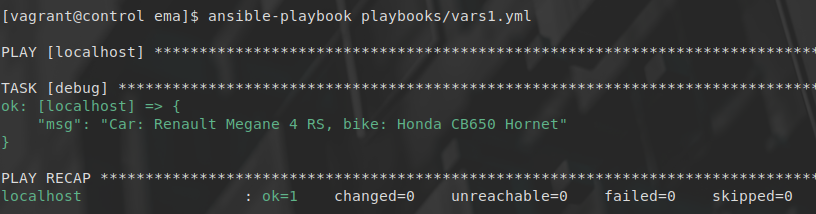
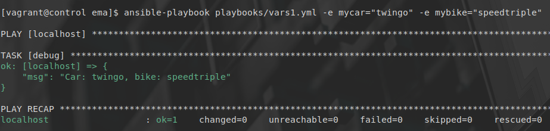
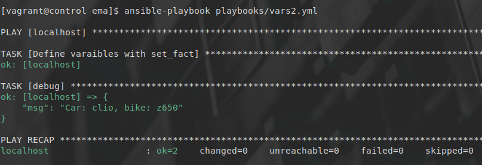
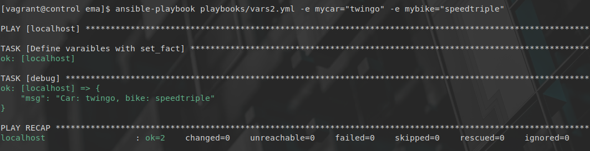
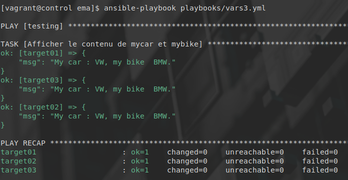
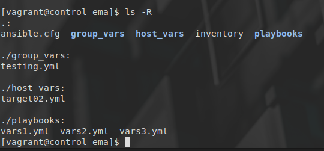
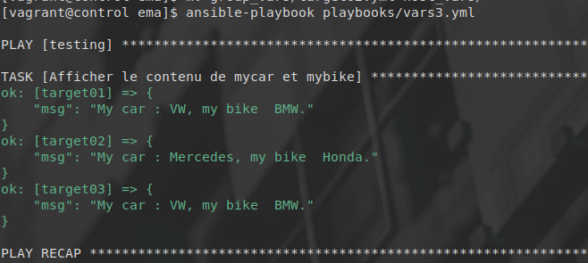
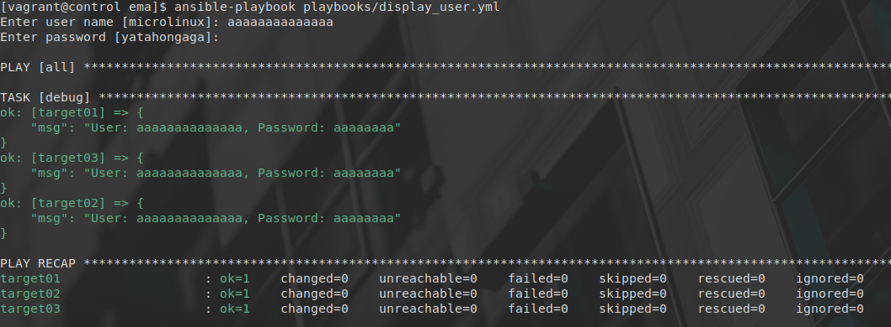
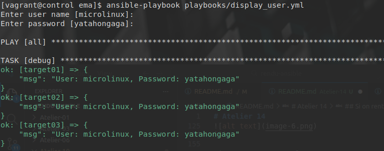

# Atelier 14
## Atelier pratique
### Initialisation des VMs

On se place dans le répertoire de l'atelier, on lance les VMs via Vagrant, puis on se connecte à la machine 'control' : 


```console
$ cd ~/formation-ansible/atelier-14
$ vagrant up
$ vagrant ssh control
```

## Challenge

 On écrit un playbook myvars1.yml qui affiche respectivement notre voiture et votre moto préférée en utilisant le module debug et deux variables mycar et mybike définies en tant que play vars.

```yaml
---

- hosts: localhost
  gather_facts: false

  vars:
    mycar: "Megane RS"
    mybike: CB500f

  tasks:
    - debug:
        msg: "Car: {{mycar}}, bike: {{mybike}}
```


---------------------------

Avec les extra vars:

```console
ansible-playbook playbooks/vars1.yml -e mycar='civic' -e mybike='H2R'
```



Écrivez un playbook myvars2.yml qui fait essentiellement la même chose que myvars1.yml, mais en utilisant une tâche avec set_fact pour définir les deux variables.

```yaml
---

- hosts: localhost
  gather_facts: false

  tasks:

    - name: Define varaibles with set_fact
      set_fact:
        mycar: "clio"
        mybike: "z650"

    - debug:
        msg: "Car: {{mycar}}, bike: {{mybike}}"
...
```

-----------------------------

Avec les extra vars:
```console
ansible-playbook playbooks/vars2.yml -e mycar="twingo" -e mybike="speedtriple
```


------------------------------

Écrivez un playbook myvars3.yml qui affiche le contenu des deux variables mycar et mybike mais sans les définir. Avant d'exécuter le playbook, définissez VW et BMW comme valeurs par défaut pour mycar et mybike pour tous les hôtes, en utilisant l'endroit approprié.

Dans group_vars/testing.yml :

```yaml
---

mycar: "VW"
mybike: "BMW"

...
```


------------------------

Effectuez le nécessaire pour remplacer VW et BMW par Mercedes et Honda sur l'hôte target02.

La structure des répertoires : 

-------------------------

group_vars/testing.yml
```yaml
---

mycar: "VW"
mybike: "BMW"

...
```

host_vars/target02.yml

```yaml
---

mycar: "Mercedes"
mybike: "Honda"

...
```


Ensuite, on lance le playbook :
```console
$ ansible-playbook playbooks/vars3.yml
```


-------------------


On écrit un playbook display_user.yml qui affiche un utilisateur et son mot de passe correspondant à l'aide des variables user et password. Ces deux variables sontsaisies de manière interactive pendant l'exécution du playbook. Les valeurs par défaut sont microlinux pour user et yatahongaga pour password. Le mot de passe ne s'affiche pas pendant la saisie.


```yaml
---

- hosts: all
  gather_facts: false

  vars_prompt:

    - name: user
      prompt: Enter user name
      default: microlinux
      private: false

    - name: password
      prompt: Enter password
      default: yatahongaga
      private: true

  tasks:
    - debug:
	msg: "User: {{user}}, Password: {{password}}"
...
```

Si on rentre une valeur :

-----------------------

Si on ne rentre aucune valeur, les valeurs par défaut sont utilisées.



