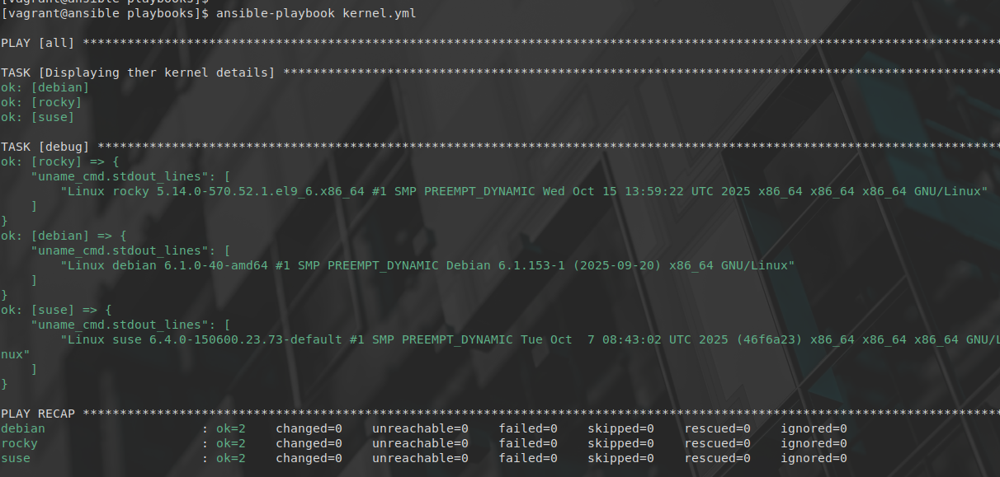

# Atelier 14
## Atelier pratique
### Initialisation des VMs

On se place dans le répertoire de l'atelier, on lance les VMs via Vagrant, puis on se connecte à la machine 'control' : 


```console
$ cd ~/formation-ansible/atelier-15
$ vagrant up
$ vagrant ssh ansible
```

## Challenge

```yaml
---

- hosts: all
  gather_facts: false

  tasks:

    - name : Displaying ther kernel details
      command: uname -a
      changed_when: false
      register: uname_cmd

    - debug:
        var: uname_cmd.stdout_lines
...
```

--------------------------

