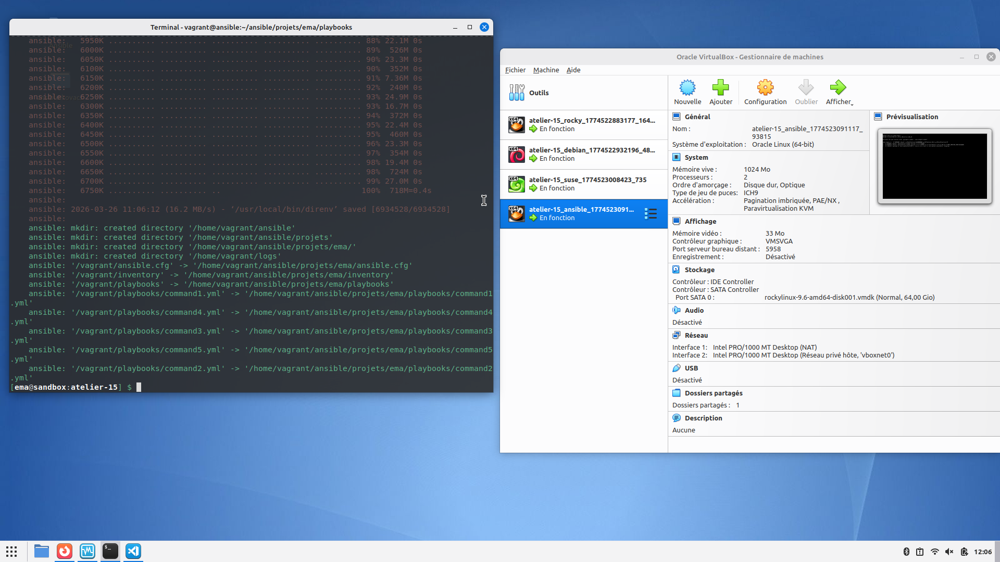
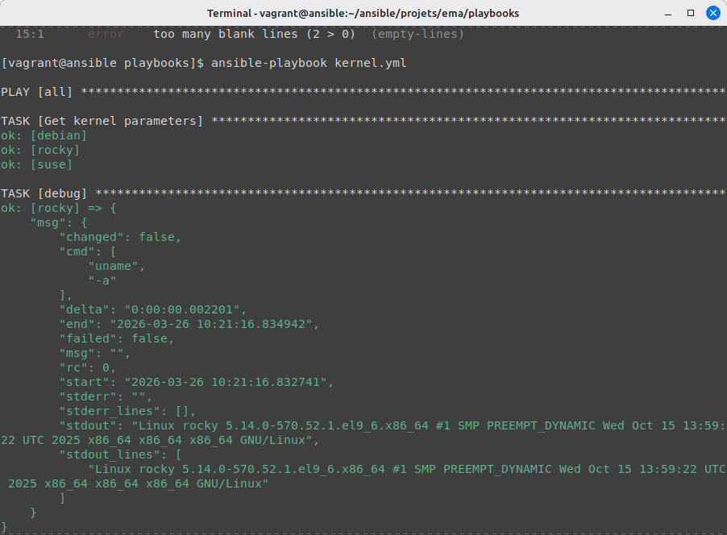
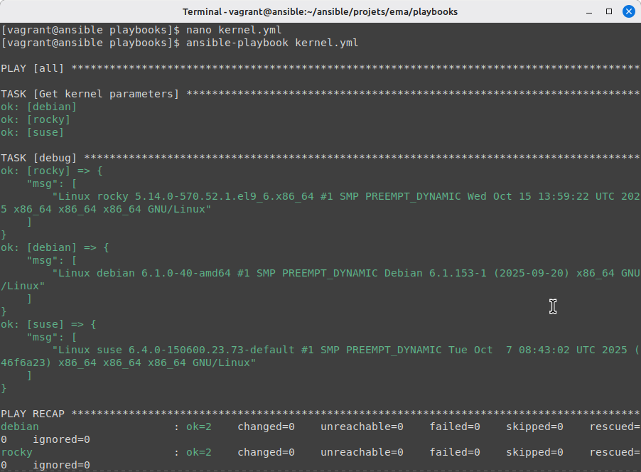
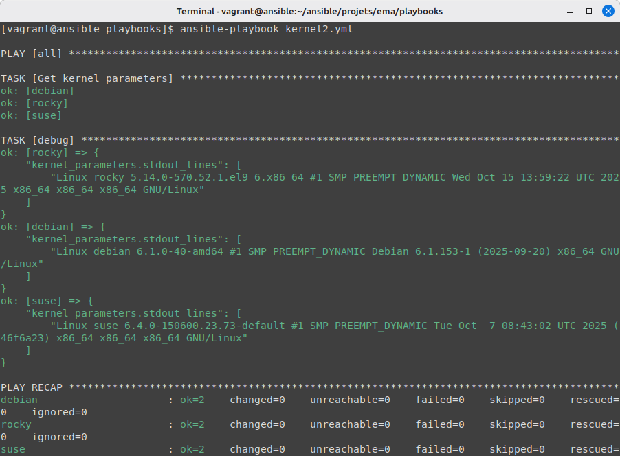
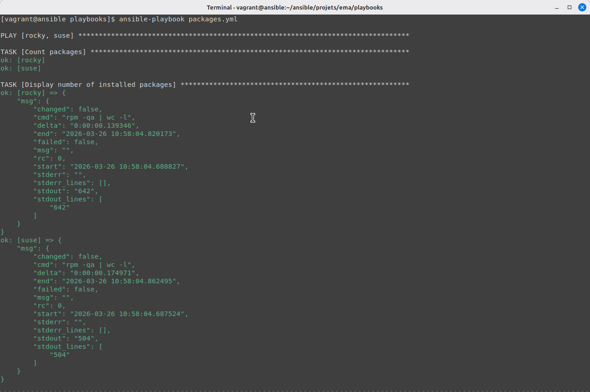
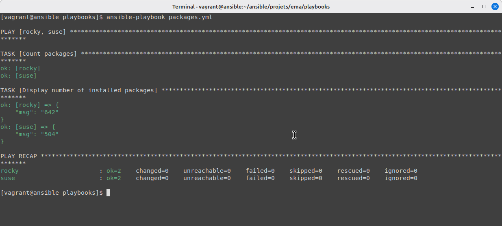

# Atelier 15 – Les variables enregistrées

## Challenge

### Démarrage des VM

Démarrez les VM depuis le répertoire `atelier-15`.

```bash
vagrant up
```



### Création du playbook kernel.yml

Écrivez un playbook `kernel.yml` qui affiche les informations détaillées du noyau sur tous vos Target Hosts. Utilisez la commande `uname -a` et le module `debug` avec le paramètre `msg`.

```yaml
--- # kernel.yml
-   hosts: all
    gather_facts: false

    tasks:

-   name: Get kernel parameters
    command: uname -a
    changed_when: false
    register: kernel_parameters

-   debug:
      msg: "{{kernel_parameters.stdout_lines}}"
```

Pour trouver le nom de la partie de la variable à afficher, on lance le playbook afin de voir la partie qui nous intéresse.



```yaml
--- # kernel.yml
-   hosts: all
    gather_facts: false

    tasks:

-   name: Get kernel parameters
    command: uname -a
    changed_when: false
    register: kernel_parameters

-   debug:
      msg: "{{kernel_parameters.stdout_lines}}"
```



### Création du playbook kernel2.yml

Essayez d'obtenir le même résultat en utilisant le paramètre `var` du module `debug`.

```yaml
--- # kernel2.yml
-   hosts: all
    gather_facts: false

    tasks:

-   name: Get kernel parameters
    command: uname -a
    changed_when: false
    register: kernel_parameters

-   debug:
      var: kernel_parameters.stdout_lines
```



Ici, comme on a déjà observé la partie de la variable qui nous intéresse (`stdout_lines`) dans le playbook `kernel.yml`, on la rajoute directement.

### Création du playbook packages.yml

Écrivez un playbook `packages.yml` qui affiche le nombre total de paquets RPM installés sur les hôtes Rocky et SUSE (`rpm -qa | wc -l`).

```yaml
--- # packages.yml
-   hosts: rocky, suse
    gather_facts: false

    tasks:

-   name: Count packages
    command: rpm qa | wc -l 
    changed_when: false
    register: packages

-   debug:
      var: packages
```

De même que pour le playbook `packages.yml`, on le lance une fois pour récupérer ce qui nous intéresse.



```yaml
--- # packages.yml
-   hosts: rocky, suse
    gather_facts: false

    tasks:

-   name: Count packages
    command: rpm qa | wc -l 
    changed_when: false
    register: packages

-   debug:
      var: packages.stdout_lines
```


