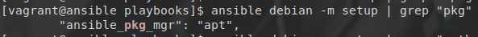
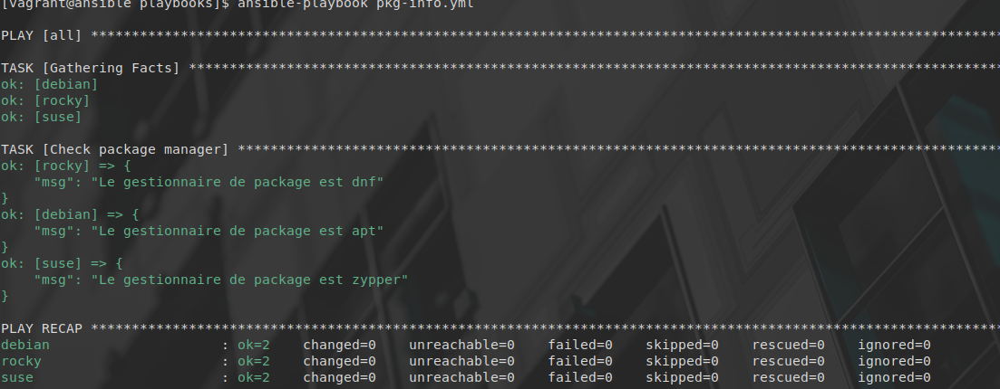
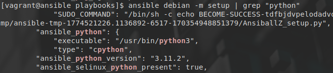
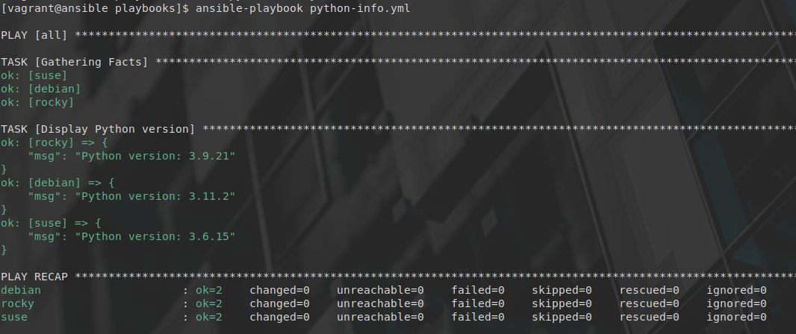
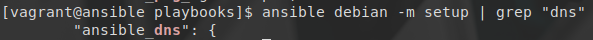
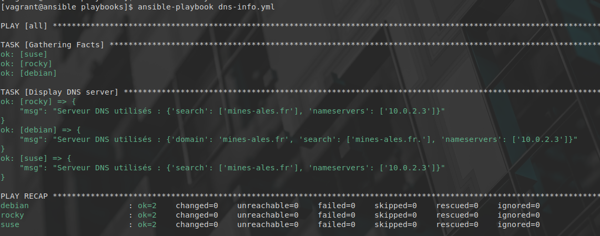

# Atelier 16
## Atelier pratique
### Initialisation des VMs

On se place dans le répertoire de l'atelier, on lance les VMs via Vagrant, puis on se connecte à la machine 'control' : 


```console
$ cd ~/formation-ansible/atelier-16
$ vagrant up
$ vagrant ssh ansible
```

## Challenge
### pkg-info.yml

On a un premier playbook qui permet de trouver le gestionnaire de paquets de la cible.

Afin de trouver le nom de la variable implicite, on peut utiliser le setup :
```console
$ ansible debian -m setup | grep "pkg"
```


Ici, on a utilisé debian, mais n'importe quelle target aurait fait l'affaire.
Dans le playbook, on peut donc utiliser cette variable.

```yaml
---

- hosts: all

  tasks:

  - name: Check package manager
    debug:
      msg: "Le gestionnaire de package est {{ansible_pkg_mgr}}"
...
```


---------------------

### python-info.yml

Pour afficher la version de Python installée.

```console
$ ansible debian -m setup | grep "python"
```



```yaml
---

- hosts: all
  gather_facts: true

  tasks:

    - name: Display Python version
      debug:
	msg: "Python version: {{ansible_python_version}}"
...
```


-----------------

### dns-info.yml

```console
$ ansible debian -m setup | grep "dns"
```


```yaml
---

- hosts: all

  tasks:

    - name: Display DNS server
      debug:
	msg: "Serveur DNS utilisés : {{ansible_dns}}"
...
```


