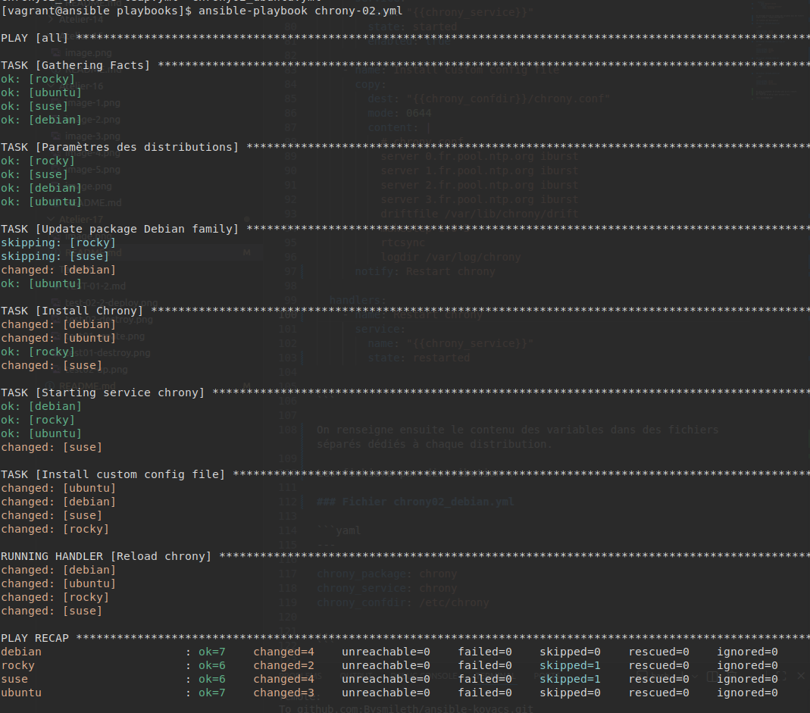

# Atelier 17
## Atelier pratique
### Initialisation des VMs

On se place dans le répertoire de l'atelier, on lance les VMs via Vagrant, puis on se connecte à la machine 'control' : 


```console
$ cd ~/formation-ansible/atelier-17
$ vagrant up
$ vagrant ssh ansible
```

## Challenge 01

Ce premier playbook, inspiré de la technique "Gros sabot", utilise le gestionnaire de package de chaque distribution, ainsi que le nom du package specifique à la distribution :

### Fichier chrony01.yml

```yaml
---

- hosts: all

  tasks:

    - name: Update package information on Debian/Ubuntu
      apt:
	      update_cache: true
        cache_valid_time: 3600
      when: ansible_os_family == "Debian"

    - name: Install Chrony on Debian
      apt:
	      name: chrony
      when: ansible_os_family == "Debian"

    - name: Install Chrony on Rocky Linux
      dnf:
	      name: chrony
      when: ansible_distribution == "Rocky"

    - name: Install Chrony on SUSE Linux
      zypper:
	      name: chrony
      when: ansible_distribution == "openSUSE Leap"

...
```

## Challenge 02

Ce playbook utilise des variables afin de gérer les noms de packages, les répertoires des fichiers de conf ou encore le nom du service :

### Fichier chrony-02.yml 

```yaml
--- 

- hosts: all
  tasks: 
    - name: Paramètres des distributions
      include_vars: >
        chrony02_{{ansible_distribution|lower|replace(" ", "-") }}.yml

    - name: Update package Debian family
      apt:
        update_cache: true
        cache_valid_time: 3600
      when: ansible_os_family == "Debian"

    - name: Install Chrony
      package:
        name: "{{chrony_package}}"

    - name: Starting service chrony
      service:
        name: "{{chrony_service}}"
        state: started
        enabled: true

    - name: Install custom config file
      copy:
        dest: "{{chrony_confdir}}/chrony.conf"
        mode: 0644
        content: |
          # chrony.conf
          server 0.fr.pool.ntp.org iburst
          server 1.fr.pool.ntp.org iburst
          server 2.fr.pool.ntp.org iburst
          server 3.fr.pool.ntp.org iburst
          driftfile /var/lib/chrony/drift
          makestep 1.0 3
          rtcsync
          logdir /var/log/chrony
      notify: Restart chrony

  handlers:
    - name: Restart chrony
      service:
        name: "{{chrony_service}}"
        state: restarted

...
```

On renseigne ensuite le contenu des variables dans des fichiers séparés dédiés à chaque distribution.

Les fichiers par distribution :

### Fichier chrony02_debian.yml

```yaml
---

chrony_package: chrony
chrony_service: chrony
chrony_confdir: /etc/chrony

...
```

### Fichier chrony02_opensuse-leap.yml

```yaml
---

chrony_package: chrony
chrony_service: chronyd
chrony_confdir: /etc
...
```

### Fichier chrony02_rocky.yml
```yaml
---

chrony_package: chrony
chrony_service: chronyd
chrony_confdir: /etc
...
```

### Fichier chrony02_ubuntu.yml

```yaml
---

chrony_package: chrony
chrony_service: chrony
chrony_confdir: /etc/chrony
...
```


On lance le playbook, et on peut voir qu'il s'éxecute parfaitement. 
PS : Tout est en OK car lancé plusieurs fois.


--------------------