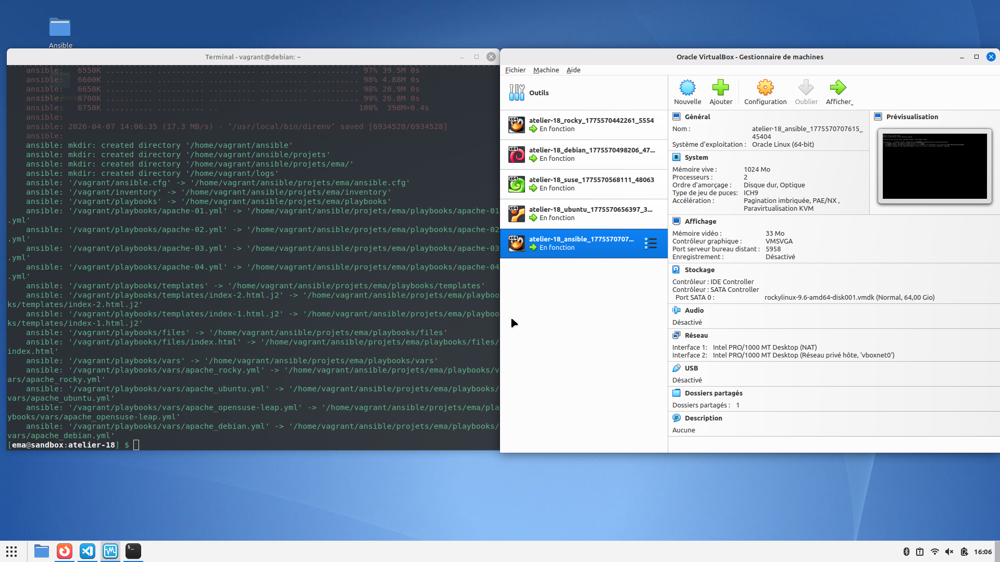
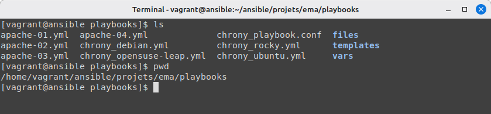
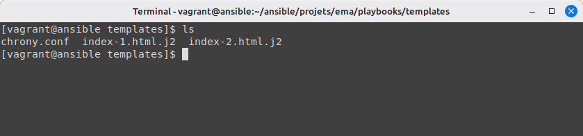
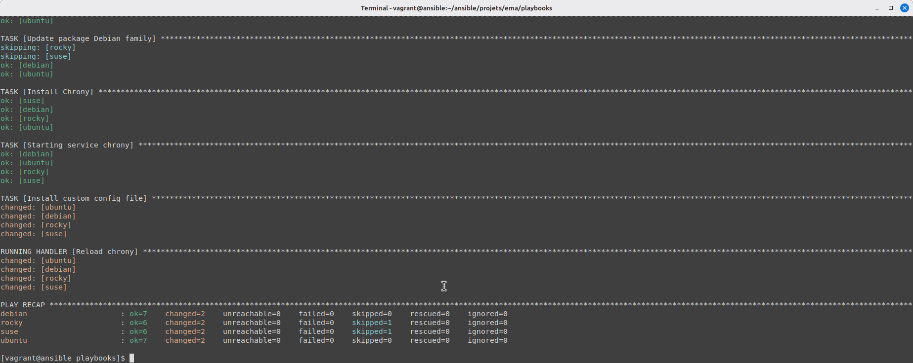
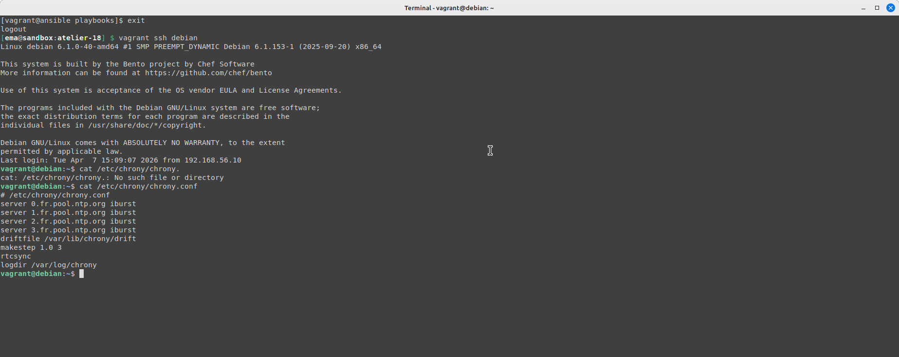

# Atelier 18 – Jinja & templates

## Challenge

### Démarrage des VM et placement dans le bon répertoire

Démarrez les VM depuis le répertoire `atelier-18`.

```bash
vagrant up
vagrant ssh ansible
cd ansible/projets/ema/playbooks/
```



### Création du playbook pour l'installation et la configuration de chrony

Écrivez un playbook chrony_playbook.yml qui installe un fichier de configuration personnalisé sur vos cibles. La première ligne de commentaire devra indiquer le chemin complet vers le fichier:

```yaml
--- 

- hosts: all
  tasks: 
    - name: Paramètres des distributions
      include_vars: >
        chrony_{{ansible_distribution|lower|replace(" ", "-") }}.yml

    - name: Update package Debian family
      apt:
        update_cache: true
        cache_valid_time: 3600
      when: ansible_os_family == "Debian"

    - name: Install Chrony
      package:
        name: "{{chrony_package}}"

    - name: Starting service chrony
      service:
        name: "{{chrony_service}}"
        state: started
        enabled: true

    - name: Install custom config file
      template:
        dest: "{{chrony_confdir}}/chrony.conf"
        mode: 0644
        src: chrony.conf
      notify: Reload chrony

  handlers:
    - name: Reload chrony
      service:
        name: "{{chrony_service}}"
        state: restarted
...
```

Ici ce qui change par rapport à l'atelier précédent, c'est qu'au lieu d'utiliser copy, nous le remplaçons par template menant au fichier chrony.conf créé précédemment.

### Création des fichiers pour chaque distribution

Les fichiers nécessaires pour que le playbook fonctionne pour les différentes distributions. Nous réutilisons ce qui a été vu précédemment, sachant qu'eux aussi se situent dans le répertoire `ansible/projets/ema/playbooks` :

Fichier chrony_debian.yml

```yaml
---

chrony_package: chrony
chrony_service: chrony
chrony_confdir: /etc/chrony

...
```

Fichier chrony_opensuse-leap.yml

```yaml
---

chrony_package: chrony
chrony_service: chronyd
chrony_confdir: /etc
...
```

Fichier chrony_rocky.yml

```yaml
---

chrony_package: chrony
chrony_service: chronyd
chrony_confdir: /etc
...
```

Fichier chrony_ubuntu.yml

```yaml
---

chrony_package: chrony
chrony_service: chrony
chrony_confdir: /etc/chrony
...
```



### Création du fichier chrony.conf dans le bon répertoire

Nous reprenons le fichier de configuration et l'installons dans le bon dossier dans lequel le playbook va venir piocher, c'est-à-dire le répertoire `ansible/projets/ema/playbooks/templates`.

cd ansible/projets/ema/playbooks/templates
nano chrony.conf.j2

Contenu du fichier :

```yaml
# {{chrony_confdir}}/chrony.conf
server 0.fr.pool.ntp.org iburst
server 1.fr.pool.ntp.org iburst
server 2.fr.pool.ntp.org iburst
server 3.fr.pool.ntp.org iburst
driftfile /var/lib/chrony/drift
makestep 1.0 3
rtcsync
logdir /var/log/chrony
```



### Exécution du playbook et vérification avec ssh



Test pour la VM Debian:

```bash
exit
vagrant ssh debian
cat /etc/chrony/chrony.conf
```


