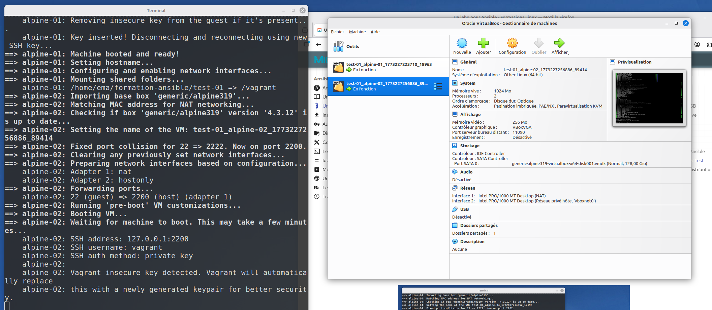
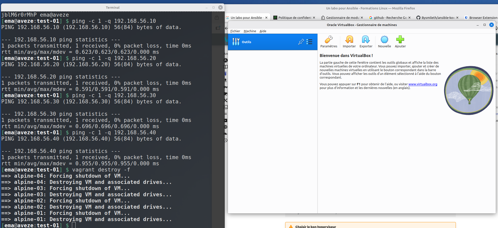
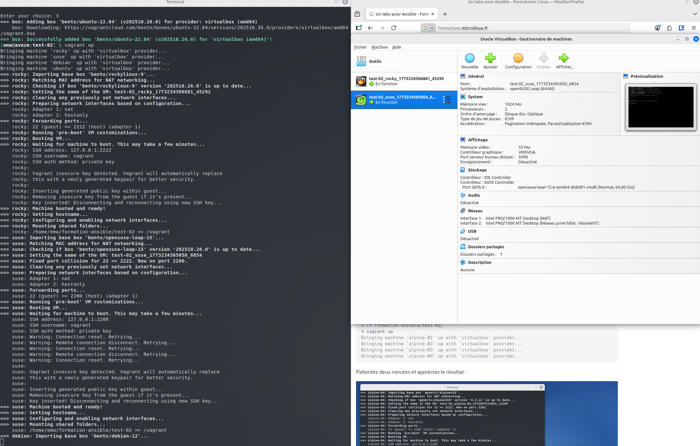
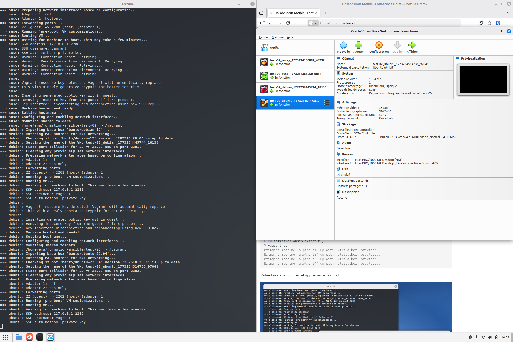
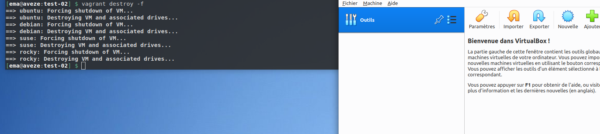

# TEST-01

Pour commencer, nous déployons les VMs via Vagrant :

Puis nous les détruisons 

# TEST-02

De la même manière, nous créons à nouveau les machines que nous avons ajouté via la commande "vagrant box add bento/..."

-----------

-----------
